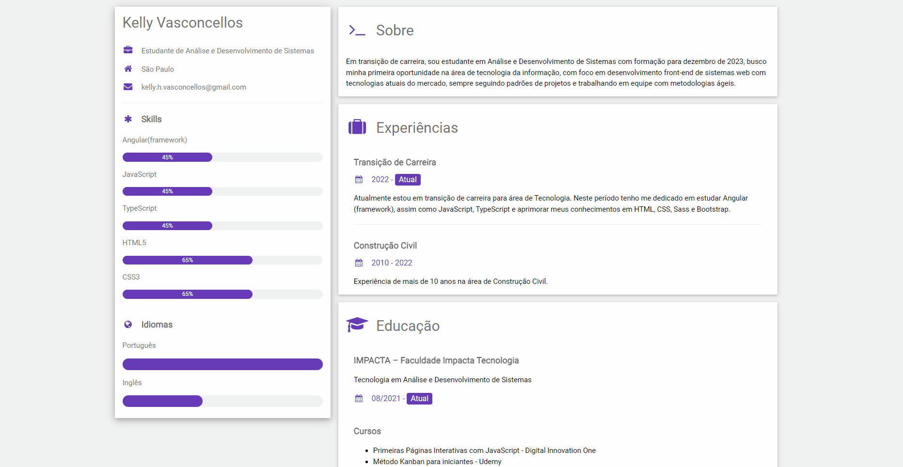

# Curriculum Vitae (CV) Online
<h1>
    
</h1>

<h3 align="center">
    <a href="https://kellyvasconcellos.github.io/cv-html/">Acessar Website</a>
<h3 >

# Indice

- [Sobre](#-sobre)
- [Tecnologias utilizadas](#-tecnologias-utilizadas)
- [Como baixar o projeto](#-como-baixar-o-projeto)

## 🔖&nbsp; Sobre

Meu Curriculum Vitae (CV) Online, elaborado com referência em W3C pela DIO: https://www.w3schools.com/howto/howto_website_create_resume.asp

---

## 🚀 Tecnologias utilizadas

O projeto foi desenvolvido pela Digital Innovation One utilizando as seguintes tecnologias:

- [HTML](https://developer.mozilla.org/pt-BR/docs/Web/HTML)
- [CSS](https://developer.mozilla.org/pt-BR/docs/Web/CSS)
- [W3C](https://www.w3schools.com)

---

## 🗂 Como baixar o projeto

```bash
    # Clonar o repositório
    $ git clone https://github.com/KellyVasconcellos/cv-html.git
    # Entrar no diretório
    $ cd cv-html
```

---

Editado 💜 por Kelly Vasconcellos
